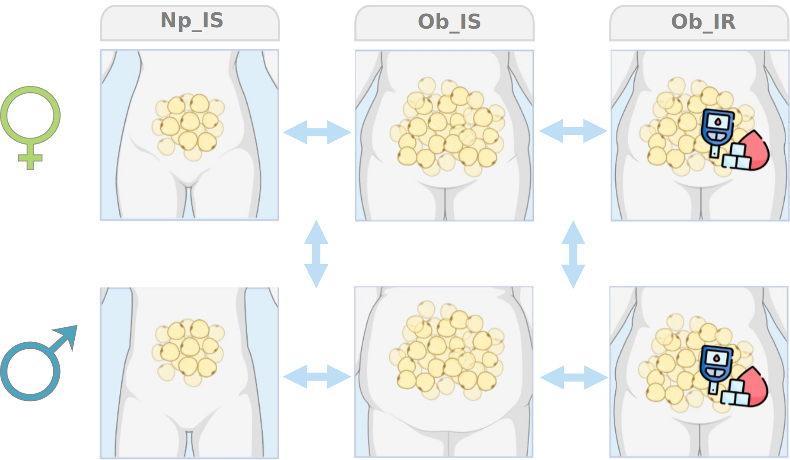

## Table Of Content  

- [Study Information](#study-information)
    - [Motivation](#motivation)
    - [Design](#design)
- [Repository Contents](#repository-contents) 
    - [Structure](#structure)
    - [Description](#description)
- [Usage](#usage) 
    - [Execution](#execution)
    - [Help](#help)
- [Dependencies](#dependencies) 


<hr>

## Study Information

### Motivation 

Over the last three decades, the prevalence of type 2 diabetes (T2D) has increased, even up to 56.4% in the younger population, primarily due to the rise in obesity. The clinical and epidemiological sex differences in obesity and T2D have been widely described. However, the underlying molecular mechanisms remain poorly understood. In this meta-analysis, we aimed to identify transcriptomic biomarkers that can provide insights into sex differences in these conditions,  as well as enhance understanding of the underlying mechanisms associated with sex differences through the integration of expression data.


### Design

<div align="center">
  
</div>
<br>

To achieve this objective, a four-step strategy was implemented:

**Step A: Systematic Review**
A systematic review of transcriptomic studies in the public repositories GEO and BioStudies was conducted following the PRISMA guidelines.

**Step B: Data Download and Bioinformatic Analysis**
The datasets from each study were downloaded, and comprehensive bioinformatic analyses were performed.

**Step C: In Silico Integration and Meta-Analysis**
The collected data were integrated using in silico techniques, employing meta-analysis approaches. Initial findings identified potential biomarkers relevant to personalized medicine in obesity and T2D, including the consideration of sex-related information.

**Step D: Interpretation and Functional Analysis**
The results were interpreted and subjected to functional analysis to gain insights into their biological implications.
 
<hr>
<br>

## Repository Contents

### Structure

>     *  
>     │
>     ├── 01SystematicReview  
>     │   └── ReviewResults.txt  
>     │     
>     ├── 02Scripts  
>     │   ├── 01Download.R    
>     │   ├── 02Preprocessing.Rmd    
>     │   ├── 03ExploratoryAnalysis.Rmd    
>     │   ├── 04DifferentialExpression.R    
>     │   ├── 05MetaAnalysis.R    
>     │   ├── 05MetaAnalysisReport.Rmd    
>     │   ├── 06FunctionalAnalysis.R    
>     │   └── 06FunctionalAnalysisReport.Rmd  
>     │     
>     ├── 03ProcessingReports
>     │   ├── DifferentialExpressionReport.html
>     │   ├── DifferentialExpressionReport.rmd
>     │   ├── Meta-analysisReport_ID.html
>     │   ├── Meta-analysisReport_ID.rmd
>     │   ├── Meta-analysisReport_IDF.html
>     │   ├── Meta-analysisReport_IDF.rmd
>     │   ├── Meta-analysisReport_IDM.html
>     │   ├── Meta-analysisReport_IDM.rmd
>     │   ├── Meta-analysisReport_IO.html
>     │   ├── Meta-analysisReport_IO.rmd
>     │   ├── Meta-analysisReport_IOF.html
>     │   ├── Meta-analysisReport_IOF.rmd
>     │   ├── Meta-analysisReport_IOM.html
>     │   ├── Meta-analysisReport_IOM.rmd
>     │   ├── Meta-analysisReport_SDID.html
>     │   ├── Meta-analysisReport_SDID.rmd
>     │   ├── Meta-analysisReport_SDIO.html
>     │   └── Meta-analysisReport_SDIO.rmd
>     │    
>     ├── 04ResultsReports
>     │   ├── 03ExploratoryAnalysis.html
>     │   ├── 05MetaAnalysisReport.html
>     │   └── 06FunctionalAnalysisReport.html
>     │    
>     ├── Data  
>     │   └── OpenTargets 
>     │       ├── DM2.tsv 
>     │       └── Ob.tsv 
>     │
>     └── Functions  
>         └── Functions.R 
>           

<br>

### Description 

- **01SystematicReview:** This directory includes the results of the systematic review and screening of 332 unique studies obtained from GEO and ArrayExpress.

- **02Scripts:** This directory contains the scripts required to execute the present work.

    - **01Download:** This script facilitates the retrieval of study data from GEO and ArrayExpress by utilizing their accession numbers.
    
    - **02Preprocessing.Rmd:** This script enables reading, normalization, and preprocessing of data from each study independently.
    
    - **03ExploratoryAnalysis.Rmd:** This script performs exploratory analysis, including boxplot, PCA, and hierarchical clustering.
    
    - **04DifferentialExpression.R:** This script performs differential expression using the *limma* package. It also generates Volcano plots and creates a report with the results.
    
    - **05MetaAnalysis.R:** This script conducts a meta-analysis using a random effects model and the DL method. It generates a report with the results, including forest plots, funnel plots, and influence plots.
    
    - **05MetaAnalysisReport.Rmd:** This report presents the results of the meta-analysis, including the number of significant biomarkers obtained by contrast, the analysis of interactions between sexes, and a search for evidence previously described in OpenTargets.
    
    - **06FunctionalAnalysis.R:** This script allows for performing functional analysis using two different methods: Over-Representation Analysis (ORA) and Gene Set Enrichment Analysis (GSEA).
    
    - **06FunctionalAnalysisReport.Rmd:** This report summarizes the results of the GSEA, including the number of enriched functions by contrast. It also groups the Gene Ontology (GO) biological processes based on their similarity using rrvgo and visualizes the results.
    
- **03ProcessingReports:** Reports obtained during the processing phase (from _02Scripts/04DifferentialExpression.R_ and _02Scripts/05MetaAnalysis.R_).

- **04ResultsReports:** Reports containing the results obtained from _02Scripts/03ExploratoryAnalysis.Rmd_, _02Scripts/05MetaAnalysisReport.Rmd_, and _02Scripts/06FunctionalAnalysisReport.Rmd_.

- **Data:** Directory to store the data from various steps of the analysis. It includes the OpenTargets information used for validation.

- **Functions:** Key functions employed in the analysis.

<hr>
<br>

## Usage   

This repository is designed to facilitate the reproduction of the current study and enable its extension for new samples, tissues, or experimental groups. The provided R scripts are designed to be applicable to a wide range of data, while the Rmd scripts contain specific steps that require manual review.

In the Execution section of each R script, you will find an example instance that can be used to reproduce the current analysis.

```r 
# ~~~~~~~~~~~~ Main ~~~~~~~~~~~~ #
#------------- Execution
```
<br>

### Execution

The configuration and execution of the scripts can be performed either directly from R or from the bash terminal. Below is an example of how to execute the _04DifferentialExpression.R_:


*R configuration:*

```r 
args <- parser$parse_args(args = c('-s=c("E_MEXP_1425","GSE2508","GSE20950", \\
                                   "GSE29718", "GSE64567","GSE92405",  \\
                                   "GSE141432","GSE205668")', 
                                   '-v=c("Obesity", "Diabetes")', 
                                   '-i=/Data',
                                   '-o=/Data/04DE',
                                   '-r',
                                   '-p')) 
``` 

*Command-line arguments:* 

```bash 
Rscript 04DifferentialExpression.R -s 'c("E_MEXP_1425","GSE2508","GSE20950", "GSE29718", "GSE64567","GSE92405", "GSE141432","GSE205668")' -v 'c("Obesity", "Diabetes")' -i '/home/rmoldovan/T2D-Meta-Analysis/Data' -o '/home/rmoldovan/T2D-Meta-Analysis/04DE' -r -p

```   

### Help  

At the beginning of each script, you will find detailed explanations of the functionality and parameters. Additionally, you can use the following commands to obtain further information:

*R configuration:*

```r 
parser$print_help()
```  

*Command-line arguments:* 

```bash 
Rscript 04DifferentialExpression.R --help
```
<hr>
<br>

### Dependencies   

During the development of this project, the following packages were required:  


  | Package                   | Version   |
  |---------------------------|-----------|
  | affy                      | 1.74.0    |
  | argparse                  | 2.2.2     |
  | ArrayExpress              | 1.56.0    |
  | AnnotationDbi             | 1.60.2    |
  | Biobase                   | 2.56.0    |
  | BiocGenerics              | 0.44.0    |
  | ComplexHeatmap            | 2.12.1    |
  | ComplexUpset              | 1.3.3     |
  | clusterProfiler           | 4.9.0.2   |
  | dichromat                 | 2.0.0.1   |
  | dplyr                     | 1.1.2     |
  | DT                        | 0.28      |
  | flextable                 | 0.9.1     |
  | GEOquery                  | 2.64.2    |
  | ggdendro                  | 0.1.23    |
  | ggforce                   | 0.4.1     |
  | ggpubr                    | 0.6.0     |
  | ggnewscale                | 0.4.9     |
  | ggrepel                   | 0.9.3     |
  | ggplot2                   | 3.4.2     |
  | glue                      | 1.6.2     |
  | ggVennDiagram             | 1.2.2     |
  | Hmisc                     | 5.1.0     |
  | hugene10sttranscriptcluster.db | 8.8.0 |
  | hgu133plus2.db            | 3.13.0    |
  | hgu95av2.db               | 3.13.0    |
  | hgu95a.db                 | 3.13.0    |
  | hgu95b.db                 | 3.13.0    |
  | hgu95c.db                 | 3.13.0    |
  | hgu95d.db                 | 3.13.0    |
  | hgu95e.db                 | 3.13.0    |
  | illuminaHumanv4.db        | 1.26.0    |
  | limma                     | 3.52.2    |
  | lumi                      | 2.48.0    |
  | KEGG.db                   | 2.1       |
  | magick                    | 2.7.4     |
  | metafor                   | 4.2.0     |
  | officer                   | 0.6.2     |
  | pacman                    | 0.5.1     |
  | plyr                      | 1.8.8     |
  | parallel                  | 4.2.0     |
  | org.Hs.eg.db              | 3.16.0    |
  | ReactomePA                | 1.40.0    |
  | S4Vectors                 | 0.34.0    |
  | SummarizedExperiment      | 1.26.1    |
  | stringr                   | 1.5.0     |
  | sf                        | 1.0.13    |
  | sva                       | 3.44.0    |
  | tidyr                     | 1.3.0     |
  | tidyverse                 | 2.0.0     |

</div>


<hr>
<br>
